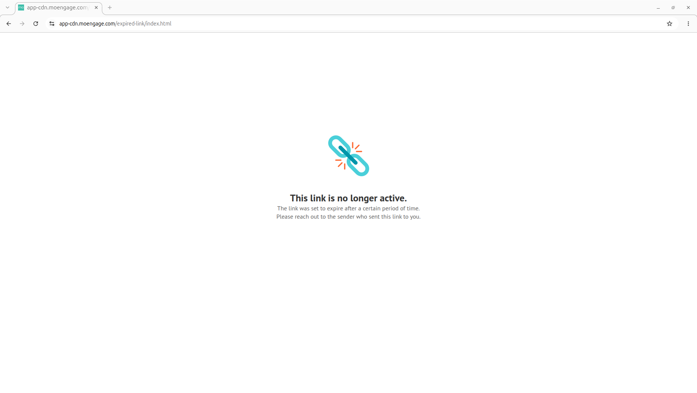
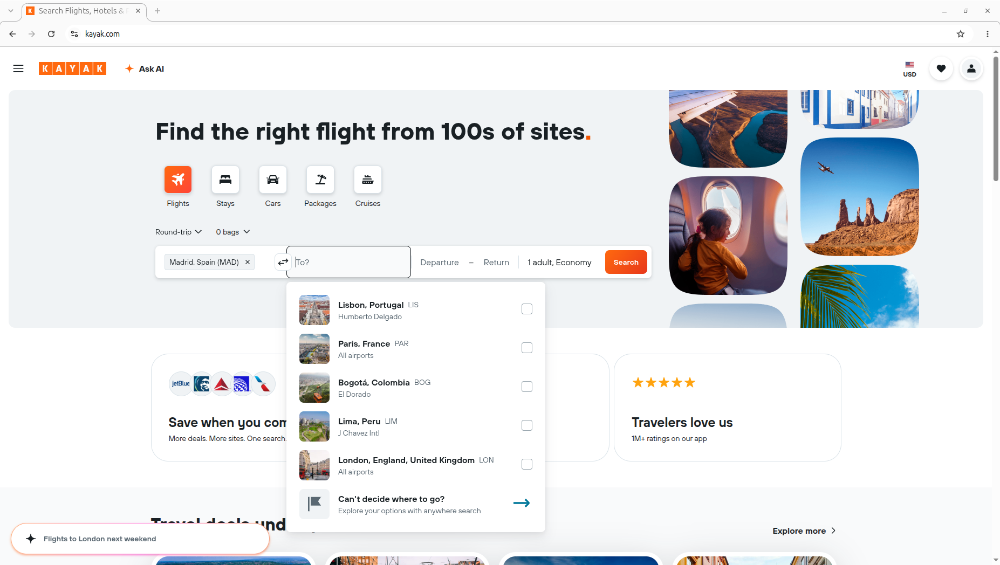

<h1 align="center">
  
  <br>
  UI Testing demo
</h1>
<p align="center">
  <b>BDD-Driven UI Testing with Playwright</b>
</p>

A hands-on demo illustrating how to conduct E2E testing with [Playwright]([Playwright](https://github.com/microsoft/playwright)) while leveraging [Cucumber]([Cucumber](https://github.com/cucumber)) to implement **BDD** methodology, with [Kayak]([Kayak]([Kayak](https://kayak.com))) serving as the target application.

## ⚙️ Get Started
First of all, execute the following command in order to build the project:

```sh
npm ci
```

Next, install the browser binaries required by **Playwright** to perform the E2E tests. For the sake of simplicity, the E2E tests were developed and verified specifically using the **Chromium** browser. Execute the following command in order to install the binary for **Chromium**:

```sh
npx --no-install playwright install chromium
```

## 🚀 Run E2E Tests
Different test scenarios were developed to cover three core business features:

* 👤 **User registration**
* 🔑 **User authentication**
* 🗑️ **User deletion**

To run the entire test suite, execute:
```sh
npm run all
```

To run a single test scenario for a specific business feature, use the corresponding script:

```sh
# 👤 User registration
npm run create

# 🔑 User authentication
npm run login

# 🗑️ User deletion
npm run delete
```

## 🧪 Testing Platforms
The E2E test suite has been successfully executed and verified on **Linux**🐧

## ⚠️ Known Issues
### 🔐 WebAuthn Bypass 
To prevent End-to-End (E2E) tests from hanging on **Windows** machines due to OS-level **WebAuthn** prompts (**Windows Hello** acting as a platform authenticator), the test suite utilizes a modern **Playwright** feature, which consists of injecting a virtual WebAuthn authenticator into the browser context, forcing **KAYAK** to bypass device-based authentication and gracefully fall back to the traditional magic link login technique.
However, clicking the account confirmation magic link opens a landing page claiming the link is no longer active. Further investigations demonstrate that this is a logic inconsistency on **KAYAK**'s website, since requesting a new confirmation link results in a message stating that the account is already verified.

<div align="center">
  <figure>
    
    <figcaption style="text-align: center">Figure 1: Landing page stating the link is no longer active</figcaption>
  </figure>
</div>

### ⚡ Host-Specific DOM Node Discrepancies
The E2E test suite successfully executed and verified on a **Linux** machine, whereas on a **Windows** machine it revealed host-dependent UI discrepancies. In particular, on the latter, the application serves an alternative UI, where the regular suggestion overlay, presenting the list of airports for the destination input, is replaced by an AI-powered search box.
For greater clarity, screenshots illustrating the UI discrepancies between host platforms are provided below.

<div align="center">
  <figure>
    
    <figcaption style="text-align: center">Figure 2: AI-powered search box rendered on a Windows host</figcaption>
  </figure>
</div>

<br>

<div align="center">
  <figure>
    
    <figcaption style="text-align: center">Figure 3: Destination airport suggestion overlay rendered on a Linux host</figcaption>
  </figure>
</div>

<br>

Finally, string formatting within the destination input is host-platform dependent. Specifically:
* **Linux Host**🐧: The destination field retains a uniform format consistent with the origin input: *City, Country (Airport Code)* (e.g., *Madrid, Spain (MAD)* and *Berlin, Germany (BER)*).
* **Windows Host**🪟: While the origin input remains unaffected, the destination field omits the country name, displaying the text only as *City (Airport Code)* (e.g., *Berlin (BER)*).

For greater clarity, screenshots illustrating the UI discrepancies between the respective host platforms are provided below.

<div align="center">
  <figure>
    
    <figcaption style="text-align: center">Figure 4: String formatting within the destination field on a Windows host</figcaption>
  </figure>
</div>

<br>

<div align="center">
  <figure>
    
    <figcaption style="text-align: center">Figure 5: String formatting within the destination field on a Linux host</figcaption>
  </figure>
</div>

<br>

While adapting the E2E test suite for cross-platform compatibility is technically feasible, it remains beyond the project's objectives. Implementing it would introduce excessive complexity, resulting in a convoluted tangle of host-platform checking conditions. Since this project was conceived as a simple, streamlined demo, adding such overhead is out-of-scope.
